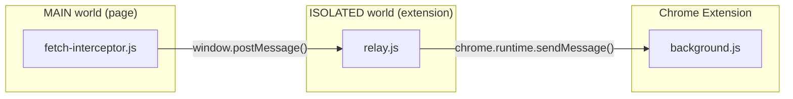

# AI Session Capture Extension — How It Works

## What Is This Extension?

When you type a message into ChatGPT and hit Send, your browser sends a **network request** to the AI company's servers and streams the response back. This extension **intercepts** that request and response in real time and pulls out useful data like how long the AI took to respond, what tool it used, and which model answered.

---

## Flow Chart

```mermaid
flowchart LR
    A["You type and hit Send"]
    B["Browser calls window.fetch()"]
    C["fetch-interceptor.js intercepts"]
    D["Reads SSE stream"]
    E["Posts via postMessage"]
    F["relay.js receives"]
    G["relay.js → background.js"]
    H["Saves to storage & updates badge"]
    I["Side panel displays results"]

    A --> B --> C --> D --> E --> F --> G --> H --> I
```

---

## Step-by-Step Breakdown

### Step 1 — Intercepting the Request

**File: `fetch-interceptor.js`** _(runs inside the webpage itself)_

Most website use a browser function called `window.fetch()` to make network requests. This script **replaces** that function with its own version the moment the page loads. The page does not know so it still calls `window.fetch()` like normal, but now our code runs first.

When a fetch request is made, the script checks:

- Is this a POST request? (AI sends are always POST)
- Does the URL match a known ChatGPT endpoint?

If so, then it:

1. **Reads the request body** to extract a preview of what the user typed
2. **Records the time** before calling the real fetch
3. **Calls the real fetch** and gets the response back
4. **Clones the response** so it can read the stream without breaking the page
5. **Reads the streaming response line by line** (this is called SSE — Server-Sent Events)

> **What is SSE?** Instead of sending one big response, AI models stream their reply back in tiny chunks called events. Each chunk is a line starting with `data:` followed by JSON. The script reads each of these lines to piece together what happened.

From the stream it extracts:

| Event Type            | What It Tells Us                                            |
| --------------------- | ----------------------------------------------------------- |
| `server_ste_metadata` | Tool used, turn mode (text/search/shopping), model name     |
| `url_moderation`      | URLs the AI fetched on your behalf (e.g. during web search) |
| `message_start`       | Model name (Claude uses this instead of metadata)           |

If the stream has **zero SSE events**, it was a background/noise request (like a telemetry ping) — the script ignores it.

Finally, it fires a `postMessage` with all the captured data tagged with `__aiCapture: true`.

---

### Step 2 — Crossing the Extension Boundary

**File: `relay.js`** _(runs in the extension's isolated world)_

**The Issue:**

Chrome extensions run scripts in an isolated world, which means they sit next to the page but can’t directly touch its variables. But the fetch-interceptor.js needs to run in the MAIN world so it can override window.fetch and actually intercept requests.

The issue is that once we are in the MAIN world, we lose access to Chrome APIs like chrome.runtime.sendMessage(). So now we can intercept the data, but can’t send it to the extension directly.

**The solution:** use `postMessage` as a bridge.

- `fetch-interceptor.js` (MAIN world) fires a `window.postMessage`
- `relay.js` (isolated world) listens for that message
- `relay.js` then calls `chrome.runtime.sendMessage()` to pass it into the extension system

---

### Step 3 — Storing the Data

**File: `background.js`** _(runs as a Chrome service worker)_

The background script manages all shared state. When it receives an `ai-capture` message from relay.js, it:

1. Assigns the send a sequential ID (`send1`, `send2`, etc.)
2. Adds it to the front of the `sends[]` array (newest first)
3. Trims the list to the last 100 sends (so that storage doesn't grow forever)
4. Saves everything to `chrome.storage.local` (persists even if you close the side panel)
5. Updates the **badge number** on the extension icon so you can see how many sends were captured
6. Sends a `sends-updated` message to notify the side panel to refresh

---

### Step 3b — Third-Party Domain Tracking

**File: `background.js`** _(webRequest API)_

Adding on to storing send data, the background script also watches **network request** the browser makes using Chrome's `webRequest` API. This works like a browser-level TShark, it sees all traffic, not just AI requests.

**How it works:**

1. Every completed request gets logged to a **rolling 90-second buffer** (domain + timestamp)
2. AI platform domains (`chatgpt.com`, `openai.com`) are filtered out because we only want third parties
3. When a send is captured, the buffer is scanned for all requests that happened between the send's start time and now
4. Each unique domain is **categorized** using the [Disconnect.me tracker database](https://github.com/disconnectme/disconnect-tracking-protection) — a community-maintained list of thousands of known trackers. It is fetched once on startup and cached locally for a week
5. If a domain isn't in the Disconnect list, then a **keyword heuristic** runs to lable it a keyword rather then an unknown
6. The resulting list of `{ domain, category }` pairs is saved as `third_party_contacts` on the send record

---

### Step 4 — Displaying the Results

**Files: `sidepanel.html`, `sidepanel.js`, `sidepanel.css`**

The side panel has four tabs — **Dashboard**, **Livestream**, **Trackers**, and **Timewise**.

**Dashboard** (daily view) — pulls from `getTodayStats()` via `aggregation-api.js`:

- Prompts today, avg response size, SSE events, avg response time (TTFB)
- Tools used today (from `todayAgg.tools_invoked`)
- Top trackers today with relative volume bar (from `todayAgg.server_fetched_domains`)
- Platform split bar — ChatGPT vs Claude (from `todayAgg.platforms`)
- "Clear" button clears aggregation stats only (`clear-aggregations`)

**Livestream** (daily view) — pulls from `get-sends` via background.js:

- Shows the 5 most recent captured sends as cards
- Each card shows: prompt preview, turn mode + tool name merged into one pill, model, TTFB, response size, third-party contacts
- Tool subtitles are dynamic — `turn_use_case` values like `image_gen` auto-format to `"image gen"` with no hardcoded lookup
- "Clear" button clears captured sends only (`clear-sends`)

**Trackers** — cumulative tracker log across all sessions

**Timewise** — daily rollups from persistent storage

The "Clear" button only appears on Dashboard and Livestream, and each clears only its own data.

---

## Full File Reference

| File                    | Where It Runs                   | What It Does                                                   |
| ----------------------- | ------------------------------- | -------------------------------------------------------------- |
| `fetch-interceptor.js`  | Inside the webpage (MAIN world) | Patches `window.fetch`, reads SSE stream, extracts data        |
| `relay.js`              | Extension isolated world        | Bridges page → extension message boundary                      |
| `background.js`         | Chrome service worker           | Stores sends, manages badge, notifies UI                       |
| `sidepanel.html/js/css` | Extension side panel            | Renders the captured send data visually                        |
| `popup.html/js/css`     | Extension popup                 | Minimal UI shown on icon click                                 |
| `manifest.json`         | Chrome config                   | Declares permissions, which scripts run where, side panel path |

---

## Info Extension Records Per Send

| Field                  | How We Get It                            | What It Means                                                       |
| ---------------------- | ---------------------------------------- | ------------------------------------------------------------------- |
| `prompt_preview`       | Parsed from POST request body            | The first 200 characters of what the user typed                     |
| `ttfb_ms`              | `Date.now()` before and after fetch      | How long (ms) before the AI sent the first byte back                |
| `turn_use_case`        | SSE `server_ste_metadata` event          | Mode: `text`, `search`, `shopping`, etc.                            |
| `tool_invoked`         | SSE `server_ste_metadata` event          | `true` if the AI used a tool (e.g. web search)                      |
| `tool_name`            | SSE `server_ste_metadata` event          | Name of the tool used (e.g. `browser`)                              |
| `model_slug`           | SSE metadata or `message_start`          | Which model answered (e.g. `gpt-4o`, `claude-3-5-sonnet`)           |
| `response_bytes`       | Counted from stream chunks               | Total size of the streamed response                                 |
| `sse_event_count`      | Counted SSE lines                        | Number of streaming data events in the response                     |
| `server_fetched_urls`  | SSE `url_moderation` events              | URLs the model went out and fetched (web search results)            |
| `third_party_contacts` | `webRequest` buffer + Disconnect.me list | Third-party domains contacted during the send, with category labels |

---

## What browser APIs and resources the Chrome extension is allowed to access?

Permissions Needed (from `manifest.json`)

| Permission                                 | Why                                                                     |
| ------------------------------------------ | ----------------------------------------------------------------------- |
| `storage`                                  | To save captured sends across sessions                                  |
| `sidePanel`                                | To show the side panel UI                                               |
| `host_permissions: chatgpt.com, claude.ai` | To inject the interceptor scripts into those pages only                 |
| `webRequest` + `<all_urls>`                | To observe all browser network requests for third-party domain tracking |

## Aggregation Setup

A key part to presenting the network data of someones AI use is helping them track it over time. Our extension now stores **aggregated statistics** that persist across browser sessions in `chrome.storage.local`.

### Setup

1.  `fetch-interceptor.js`

- captures requests
- postMessage sends to relay.js

2. `relay.js`
   - bridge to chrome APIs (chrome.runtime.sendMessage)
   - sends to background.js
3. `background.js`
   - service worker
   - calls addCapture() -> handles aggregation of new network traffic data, adds it to the data totals
4. `storage-aggregator.js`
   - helper functions for aggregation and handling aggregated data
5. `aggregation-api.js`
   - API for returning selected data from chrome.storage.local and parsing the object in which all the aggregations are stored in
6. `sidepanel.js`
   - calls `getTodayStats()` from `aggregation-api.js` on load
   - dashboard avg TTFB comes from `todayAgg.latency_stats.avg_ttfb_ms` (falls back to in-memory sends if aggregation unavailable)
   - dashboard tool breakdown comes from `todayAgg.tools_invoked`
   - both cover the full day, not just sends captured since the panel was opened

Each day's aggregation includes:

### Counters

- **total_captures**: Total number of requests captured
- **platforms**: Breakdown by ChatGPT vs Claude
- **models**: Usage count per model, distinct within ChatGPT and Claude

- **tools_invoked**: Which tools were used (web_search, code_interpreter, etc.)
- **turn_use_cases**: Type breakdown: thinking, text, etc.
- **server_fetched_domains**: Third-party domains contacted (with counts)

### Response Statistics

- **total_bytes**: Sum of all response bytes
- **total_chars**: Sum of all response characters
- **avg_bytes**: Average response size
- **max_bytes / min_bytes**: Response size range
- **total_sse_events**: Total SSE stream events

### Latency Statistics

- **total_ttfb_ms**: Sum of time-to-first-byte
- **avg_ttfb_ms**: Average latency
- **max_ttfb_ms / min_ttfb_ms**: Latency range

### Prompt Statistics

- **total_length**: Sum of prompt characters sent
- **avg_length**: Average prompt size
- **max_length / min_length**: Prompt size range
